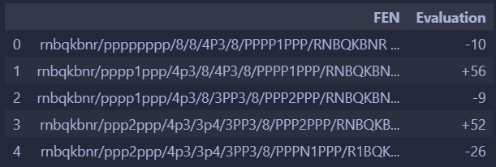
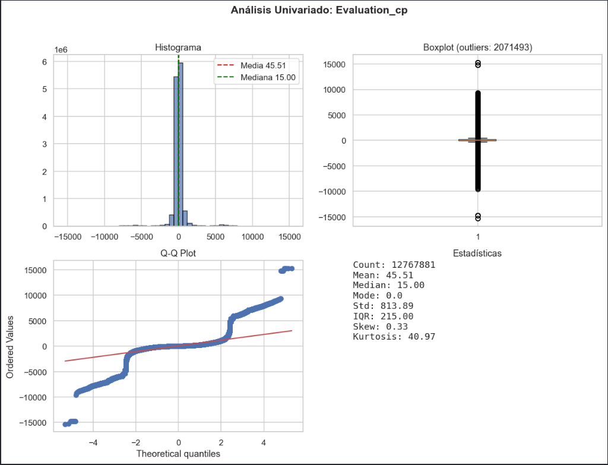
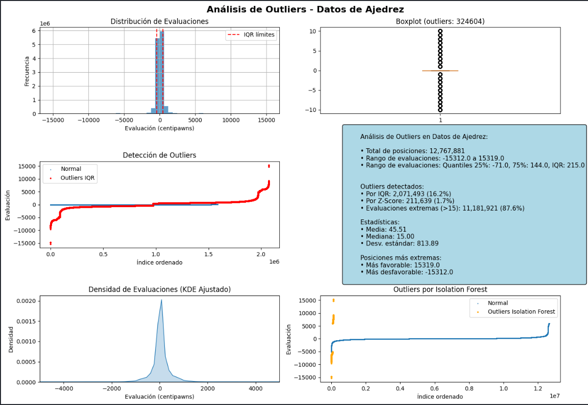
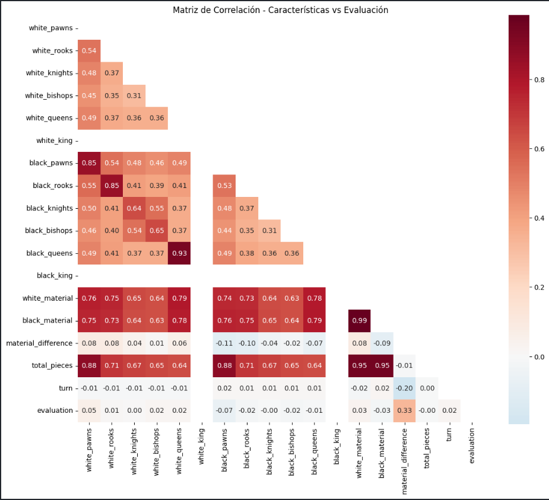
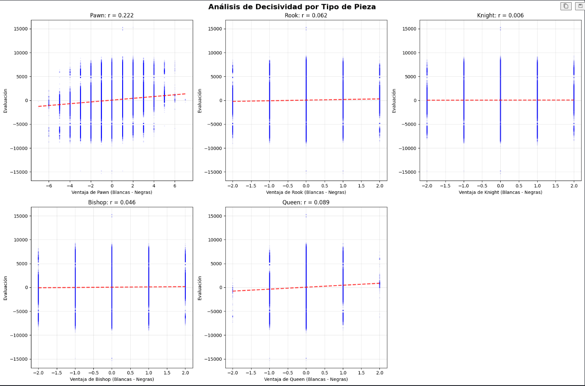

# StockSalmon 
## EDA de posiciones de ajedrez con evaluaciones de Stockfish

Este repositorio contiene un pipeline de Análisis Exploratorio de Datos (EDA) sobre un dataset masivo de posiciones de ajedrez en formato FEN y sus evaluaciones de Stockfish. El objetivo es entender la estructura del dataset, estandarizar la lectura/limpieza, extraer características relevantes desde FEN y estudiar relaciones con la evaluación del motor (centipawns y mates).


## Contenido del repo

- `functions/`: utilidades reutilizables para los notebooks
  - `functions.py`: `load_csv` robusto (PyArrow, manejo de líneas corruptas) y rutas a `../data/raw`.
  - `fen_analyzer.py`: extracción de features desde FEN:
    - `extract_active_turn`: turno al mover (`white`/`black`).
    - `extract_castling_rights`: derechos de enroque por lado + estado compacto y `ep_available`.
    - `extract_queen_presence`: presencia y conteo de damas.
    - `extract_bishop_parity`: colores de alfiles por lado y paridad (`same`/`opposite`/`na`).
  - `__init__.py`: re-exporta funciones para importación sencilla en notebooks.
- `notebooks/` (orden sugerido):
  - `00_fetch_data.ipynb`: descarga datos desde Google Drive y descompresión en `data/raw`.
  - `01_structure.ipynb`: inspección estructural (formas, tipos, memoria, nulos, únicos).
  - `02_univariate.ipynb`: parsing de evaluaciones (CP vs mates) y estadística univariada.
  - `03_uva.ipynb`: univariadas categóricas/segmentaciones (turno, enroques, damas, etc.).
  - `04_missing_values.ipynb`: auditoría de valores faltantes (reales vs ingeniería de features).
  - `05_outliers.ipynb`: detección/visualización de outliers de evaluación.
  - `06_correlations.ipynb`: ingeniería de features desde FEN y correlaciones con evaluación.
- `pyproject.toml`, `requirements.txt`: metadatos del paquete y dependencias de notebooks.

## Dataset

- Archivo principal: `data/raw/chessData.csv`
- Tamaño reportado: 12,958,035 filas × 2 columnas (`FEN`, `Evaluation`)
- Tipos (PyArrow backend): `string[pyarrow]` para ambas columnas
- Memoria aprox.: ~832 MB (medido al cargar con PyArrow)
- Únicos: `FEN` ~12.95M; `Evaluation` ~13.5k; nulos: 0

> 


## Instalación y entorno

- Python ≥ 3.10
- Dependencias (notebooks): ver `requirements.txt`

Pasos sugeridos (entorno virtual opcional):

```bash
# 1) Crear entorno y activar
python -m venv .venv
source .venv/bin/activate  # Windows: .venv\Scripts\activate

# 2) Instalar el paquete utilitario (editable) y deps de notebooks
pip install -e .
pip install -r requirements.txt
```

Nota: el dataset es grande. Para máquinas con recursos limitados, considerar trabajar con `nrows=...` o muestreos en los notebooks.


## Pipeline EDA (resumen)

0) Obtención de datos
- `00_fetch_data.ipynb` descarga un ZIP desde Google Drive y extrae `chessData.csv` (y opcionalmente `random_evals.csv`, `tactic_evals.csv`) a `data/raw`.

1) Estructura y calidad
- `01_structure.ipynb` revisa dimensiones, tipos, memoria, nulos y cardinalidad. Confirmación de 2 columnas (`FEN`, `Evaluation`) sin nulos.

2) Parsing de evaluación (CP y mates)
- `02_univariate.ipynb` convierte `Evaluation` a:
  - `Evaluation_cp` (centipawns, numérico)
  - `Evaluation_mate_sign` (1/-1/0)
  - `Evaluation_mate_in` (jugadas hasta mate)
- Se separan mates (p. ej., `#±N`, `M±N`) del continuo en CP.

> 

3) Features desde FEN (categóricas y numéricas)
- `functions/fen_analyzer.py` aporta utilidades vectorizables:
  - Turno, enroques, en-passant, presencia de damas, paridad de alfiles.
> [Ver resultados de categorización de posiciones](notebooks/03_uva.ipynb)


4) Univariadas categóricas y segmentaciones
- `03_uva.ipynb` analiza frecuencias/top-K y distribuciones del objetivo por categoría (turno, estado de enroque, damas, EP, …). Boxplots y tablas resumen por categoría.

> [Ver resultados de categorización de posiciones](notebooks/03_uva.ipynb)


5) Outliers de evaluación
- `05_outliers.ipynb` mapea mates a ±magnitudes y convierte a numérico; aplica IQR, Z-score, umbrales (|eval|>10), e IsolationForest.
- Resultado ejemplo: filas limpias ≈ 12.77M (−190k), rango aprox. de evaluación ±15k CP.

> 


6) Correlaciones desde la evaluacion y como esta afecta al material por lado, diferencia de material, total de piezas, factores decisivos para la victoria según material, cuales piezas aportan más al posible resultado final de la partida.
- `06_correlations.ipynb` calcula matriz de correlación y produce rankings.
- Top correlaciones absolutas con `evaluation` (ejemplo observado):
  - `material_difference`: 0.326
  - `black_pawns`: 0.069; `white_pawns`: 0.054
  - `white_material`: 0.030; `black_material`: 0.026
  - `white_queens`: 0.025; `white_bishops`: 0.022
  - `turn`: 0.019; `black_rooks`: 0.019; `black_bishops`: 0.017
- “Decisividad”: se definen ventajas por tipo de pieza (diferencias) y se contrasta su relación con la evaluación (correlaciones/boxplots y diferencia de medias ventaja−desventaja).
- `06_correlations.ipynb` 
> 

> 


## Hallazgos clave

- Importancia del material: la diferencia de material es el predictor simple dominante (|r|≈0.33).
- Iniciativa (turno): sesgo favorable a blancas al mover (media ~+61 cp vs ~+30 cp negras; mediana 49 vs 0).
- Fase del juego: menor total de piezas tiende a evaluaciones más extremas (finales “más decisivos”).
- Mates/outliers: manejar aparte; mapear a ±grandes magnitudes o separar el target para evitar sesgos.
- Categóricas informativas: enroques, EP, presencia de damas; la paridad de alfiles puede aportar en finales específicos.


## Cómo ejecutar los notebooks

1) Descargar datos con `00_fetch_data.ipynb` (requiere acceso a Drive) o colocar manualmente los CSV en `data/raw/`.
2) Ejecutar en orden: `01_structure` → `02_univariate` → `03_uva` → `04_missing_values` → `05_outliers` → `06_correlations`.
3) En máquinas limitadas, usar `nrows=...` y/o muestreos estratificados (p. ej., por turno o fase del juego).

Sugerencias de rendimiento:
- Preferir operaciones vectorizadas; evitar bucles por fila para parseos masivos de FEN.
- Considerar `dtype_backend='pyarrow'` (activado en `load_csv`) y cargas parciales.


## Buenas prácticas y reproducibilidad

- Utilidades empaquetadas en `functions/` para reuso entre notebooks.
- Lectura robusta de CSV con PyArrow y tolerancia a líneas corruptas.
- Normalización consistente de evaluación (CP y mates) antes de análisis.
